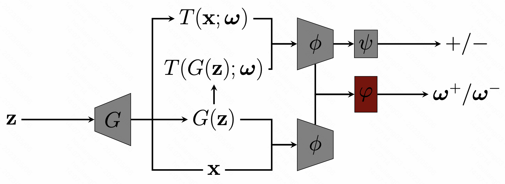

# AugSelf-GAN &mdash; Official PyTorch Implementation



[**Augmentation-Aware Self-Supervision for Data-Efficient GAN Training**](https://arxiv.org/abs/2205.15677)<br>

## Overview

## AugSelf-BigGAN on CIFAR-10 and CIFAR-100

Please refer to the [augself-biggan](https://github.com/liang-hou/augself-gan/tree/main/augself-biggan) README to run *AugSelf-BigGAN* for conditional generation on CIFAR-10 and CIFAR-100.

## AugSelf-StyleGAN2 on FFHQ, LSUN-Cat, and five low-shot datasets

Please refer to the [augself-stylegan2](https://github.com/liang-hou/augself-gan/tree/main/augself-stylegan2) README to run *AugSelf-StyleGAN2* for unconditional generation on FFHQ, LSUN-Cat, and five low-shot datasets.

## Citation

If you find this code helpful, please cite our paper:
```
@inproceedings{hou2023augselfgan,
  title={Augmentation-Aware Self-Supervision for Data-Efficient GAN Training},
  author={Liang Hou, Qi Cao, Yige Yuan, Huawei Shen, Xueqi Cheng},
  booktitle={arXiv},
  year={2023}
}
```
